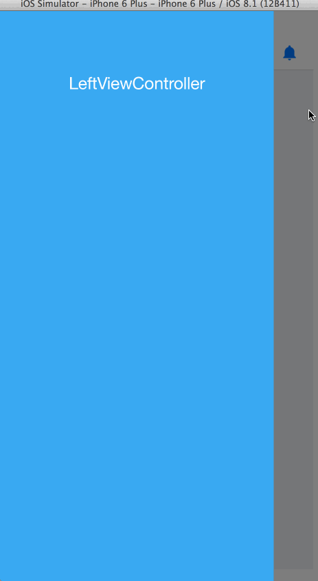

SlideMenuControllerSwift
========================

[](https://developer.apple.com/iphone/index.action)
[](https://developer.apple.com/swift)
[](http://mit-license.org)
[](https://github.com/dekatotoro/SlideMenuControllerSwift/issues?state=open)


iOS Slide View based on iQON, Feedly, Google+, Ameba iPhone app.



##Installation

####CocoaPods
```
pod 'SlideMenuControllerSwift'
```
  
####Manually
Add the `SlideMenuController.swift` file to your project. 

##Usage

###Setup

Add `import SlideMenuControllerSwift` in your file

In your app delegate:

```swift

func application(application: UIApplication, didFinishLaunchingWithOptions launchOptions: [NSObject: AnyObject]?) -> Bool {

    // create viewController code...
        
    let slideMenuController = SlideMenuController(mainViewController: mainViewController, leftMenuViewController: leftViewController, rightMenuViewController: rightViewController)
    self.window?.rootViewController = slideMenuController
    self.window?.makeKeyAndVisible()    

    return true
}
```

If you want to use the custom option, please set them before calling the init method, like so:

```swift
SlideMenuOptions.leftViewWidth = 50
SlideMenuOptions.contentViewScale = .50
...
    
```

###You can access from UIViewController

```swift
self.slideMenuController()?
```
or
```swift
if let slideMenuController = self.slideMenuController() {
    // some code
}
```
### add navigationBarButton 
```swift
viewController.addLeftBarButtonWithImage(UIImage(named: "hoge")!)
viewController.addRightBarButtonWithImage(UIImage(named: "fuga")!)
```

### open and close
```swift
// Open
self.slideMenuController()?.openLeft()
self.slideMenuController()?.openRight()

// close
self.slideMenuController()?.closeLeft()
self.slideMenuController()?.closeRight()
```

## Requirements
Requires Swift1.2 and iOS 7.0 and ARC.  
If you are developing in the swift1.1, please use branch of swift1.1.  
  
## Features
- Highly customizable
- Complete example


## Contributing

Forks, patches and other feedback are welcome.

## Creator

[Yuji Hato](https://github.com/dekatotoro) 
[Blog](http://buzzmemo.blogspot.jp/)

## License

SlideMenuControllerSwift is available under the MIT license. See the LICENSE file for more info.
